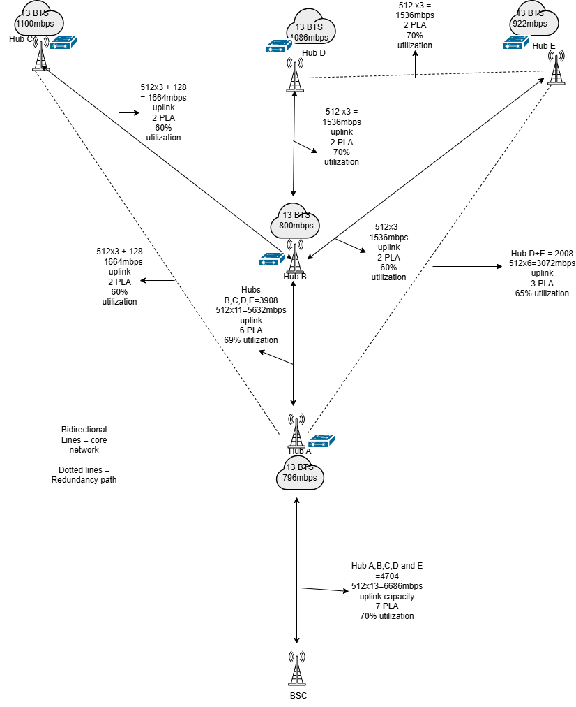
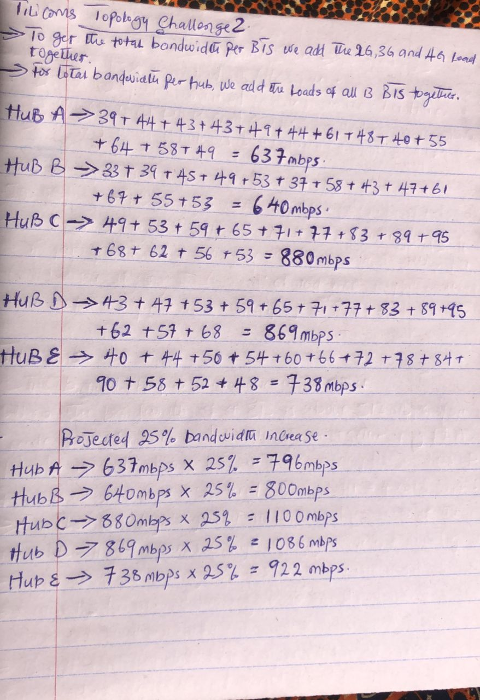

📡 Telecom Transmission Planning & Aggregation Design Challenge
Overview

This project documents the solution to a telecommunications transmission planning challenge involving bandwidth calculation, Busy Hour Traffic (BHT) engineering, microwave backhaul dimensioning, redundancy planning, and future capacity growth.

The objective was to design a resilient aggregation network for multiple BTS sites distributed across an urban, suburban, and inter-city corridor, while respecting utilization, latency, and availability constraints.

This project demonstrates:

Practical telecom traffic engineering

Microwave transmission planning using Packet Link Aggregation (PLA)

Redundancy and protection design

Capacity planning with future growth considerations

Clear documentation and topology visualization

## 📋 Challenge Statement

Each student was assigned a logical cluster of **65 live BTS sites** distributed across a dense urban core, suburban districts, and an inter-city highway corridor. The BTS sites were grouped under **five aggregation hubs (Hub A, Hub B, Hub C, Hub D, and Hub E)**.

These hubs represent real aggregation locations where BTS traffic is backhauled using a **hybrid transmission network of fiber and licensed microwave links**. **Hub A** is the only hub directly connected to the **BSC** at the regional switching center and also provides onward connectivity to the IP core for packet services.

For each BTS, carried traffic is split across:
- **2G** (voice)
- **3G** (packet data)
- **4G** (high-speed data and real-time services)

Students were required to:
- Calculate the total bandwidth per BTS
- Engineer the network based on **Busy Hour Traffic (BHT)**
- Ensure no link exceeds **70% utilization**
- Dimension uplinks from Hub B, C, D, and E toward Hub A
- Determine total bandwidth required on the **Hub A – BSC** link

### Additional Design Constraints

- **Redundancy Requirement:**  
  The network must meet a **99.95% availability target**. If any single uplink from Hub B, C, D, or E to Hub A fails, traffic must be rerouted through other hubs using protection links with **30% additional headroom** and no oversubscription.

- **Latency Constraint:**  
  4G traffic must not traverse more than **two hub hops** to reach Hub A under both normal and failure conditions. Each hub-to-hub hop introduces **2 ms latency**.

- **Future Planning Rule:**  
  All links must be dimensioned to support a **25% traffic growth** projected over the next 18 months, without requiring upgrades.

📘 Challenge Description

Each student was assigned 65 live BTS sites, grouped under five aggregation hubs:

Hub A

Hub B

Hub C

Hub D

Hub E

Key constraints:

Each BTS carries 2G (voice), 3G (packet data), and 4G (high-speed & real-time services)

Traffic values represent Average Hour Traffic

Network must be engineered for Busy Hour Traffic (BHT)

No transmission link should exceed 70% utilization

Hub A is the only hub directly connected to the BSC and IP core

Aggregation is performed using fiber and licensed microwave links

🧮 Methodology
1️⃣ Total Bandwidth per BTS

For each BTS, total bandwidth was calculated by summing:

2G Traffic + 3G Traffic + 4G Traffic

2️⃣ Total Busy Hour Traffic per Hub

For each hub:

The total bandwidth of all 13 BTSs under that hub was summed

This represents the Busy Hour Traffic (BHT) for the hub

3️⃣ Future Traffic Growth

A 25% projected traffic growth over 18 months was applied:

Projected Traffic = Current BHT × 1.25

📊 Busy Hour Traffic Results
Hub	Current BHT (Mbps)	Projected BHT (+25%)
Hub A	637 Mbps	796 Mbps
Hub B	640 Mbps	800 Mbps
Hub C	880 Mbps	1100 Mbps
Hub D	869 Mbps	1086 Mbps
Hub E	738 Mbps	922 Mbps
🔗 Packet Link Aggregation (PLA)

Packet Link Aggregation (PLA) is a microwave transmission technique used to bundle multiple physical radio channels into a single logical link.

In this project:

Each PLA represents a 512+ Mbps licensed microwave channel

Multiple PLAs are aggregated to meet traffic demand

Utilization is engineered to remain ≤ 70% during Busy Hour

PLA allows scalable capacity without deploying new radios

Note: PLA in this project refers to Packet Link Aggregation, not Peak Load Allowance.

🛜 Uplink Capacity Engineering

For each hub (B–E), uplinks toward Hub A were dimensioned using:

Busy Hour Traffic

70% utilization constraint

Future traffic growth

PLA-based aggregation

Example:

2 × 512 Mbps PLA = 1024 Mbps logical uplink

Utilization calculations ensured all links remained within safe operational thresholds.

## 📊 Link Utilization Calculation

Transmission links were engineered to ensure that utilization does not exceed **70% during Busy Hour**, in line with standard telecom planning practices.

Link utilization was calculated using the formula:

Utilization (%) = (Traffic Load / Total Uplink Capacity) × 100

### Example Calculation

If a hub has a Busy Hour traffic load of **800 Mbps** and is provisioned with **2 × 512 Mbps PLA links**:

Total Uplink Capacity = 1024 Mbps

Utilization = (800 / 1024) × 100 ≈ **78%**

In this case, additional PLA capacity would be required to bring utilization within acceptable limits.

All final uplink designs in this project were dimensioned to operate at **≤ 70% utilization** under Busy Hour conditions.

🔁 Redundancy & Protection Design

To meet a 99.95% availability target, the network was designed with inter-hub protection paths:

If any single uplink to Hub A fails, traffic can reroute through other hubs

Protection links include 30% additional headroom

Oversubscription is not permitted

Dotted links in the topology represent redundancy paths

⏱️ Latency Constraint Validation

4G traffic is latency-sensitive

Maximum allowed hops to Hub A: 2 hops

Each hub-to-hub hop introduces 2 ms latency

✔ All normal and failure paths were validated to remain within latency limits.

🧱 Hub A – BSC Link Dimensioning

Hub A aggregates traffic from:

Hub A local BTSs

Hub B, C, D, and E

Total aggregated Busy Hour traffic (including growth) was used to dimension the Hub A → BSC uplink, ensuring:

≤ 70% utilization

Sufficient PLA capacity

Support for redundancy scenarios

🗺️ Network Topology
Aggregation & Redundancy Design

Solid lines → Core transmission paths

Dotted lines → Redundant protection paths

📝 Calculation Evidence

Handwritten calculations were used to:

Validate BTS totals

Derive hub-level Busy Hour Traffic

Apply future growth projections

🧠 Key Takeaways

Real-world telecom transmission planning requires strict utilization discipline

PLA is critical for scalable microwave backhaul

Redundancy must be engineered, not assumed

Latency constraints strongly influence topology decisions

Capacity planning must always account for future growth

🧰 Tools Used

Manual traffic engineering calculations

draw.io – topology design

GitHub Pages / Markdown – documentation

Telecom transmission planning principles

📌 Author

Precious Anyanwu
Aspiring Network / Cloud / Security Engineer
Documenting hands-on telecom and cybersecurity projects
